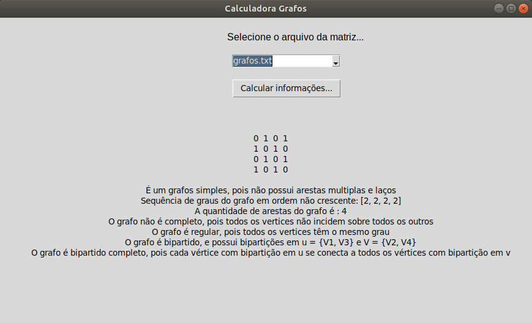

# Calculadora Grafos 

Projeto semestral da matéria de Teoria dos Grafos, ministrada no Centro Universitário FEI. Consiste na leitura de um arquivo que contem uma matriz, sendo que essa representa um grafo. A partir de sua leitura exibe-se determinadas informações sobre o grafo.

## Funcionalidade

O programa lê o arquivo de texto selecionado pelo usuário que contêm uma matriz de adjacência do grafo.

**1 - Grafo simples** - Exibe se o grafo referente a matriz de adjacencia do arquivo é simples. Lembrando que um grafo simples é aquele que não possui arestas multiplas e nem laços. 

**2 - Sequência de Graus** - Exibe a sequência de graus do grafo em ordem não crescente. Lembrando que um grau de um vértice é o número de arestas que incidem sobre ele.

**3 - Quantidade de Arestas** - Exibe a quantidade de arestas do grafo.

**4 - Grafo Regular** - Exibe se o grafo é regular ou não. Sendo que um grafo é dito ser regular quando todos os seus vértices têm o mesmo grau

**5 - Grafo Bipartido** - Exibe se o grafo em questão é bipartido e caso seja exibe também suas bipartições de vértices. Sendo que um grafo é dito ser bipartido quando seu conjunto de vértices V puder ser particionado em dois subconjuntos X e Y, tais que toda aresta de G une um vértice de X a outro de Y.

**6 - Grafo Bipartido Completo** - Informa se o grafo é bipartido completo. Lembrando que um grafo bipartido completo ocorre quando é possivel dividir em duas partições e com todo vértice de uma sendo adjacente a todo vértice da outra partição.



## Execução

Tanto no Windows quanto no Linux a execução é feita a partir da execução da linha a seguir no terminal, ou utilizando uma IDE de sua preferência. 

```bash
python mainWindow.py
```

Entretanto, utilizando apenas a linha acima é possivel que o compilador de sua máquina utilize o python em sua versão 2.7. Para resolver isso é mais vantajoso utilizar:

```bash
python3 mainWindow.py
```